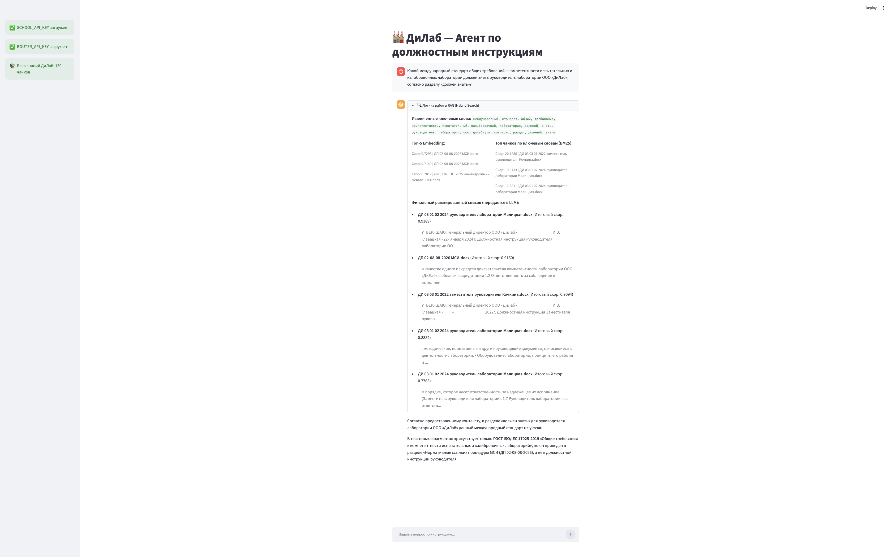
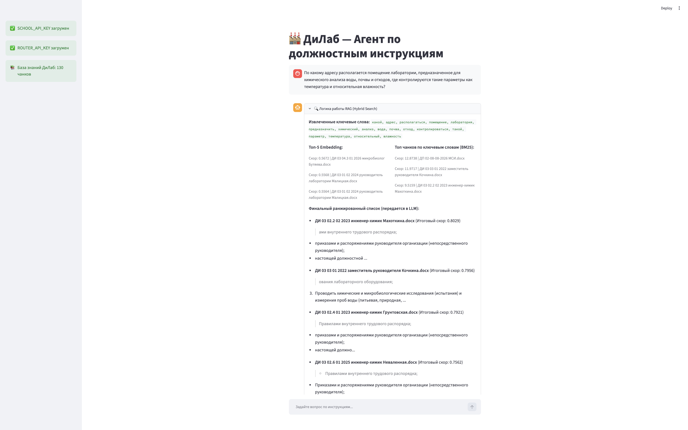
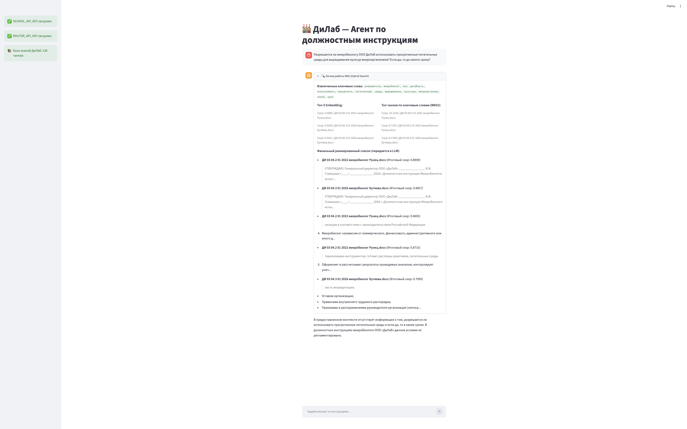

# Отчет о выполнении домашнего задания: Внедрение Hybrid Search в RAG-систему

**Выполнил:** Абрамова Оксана Витальевна

---

## 1. Архитектурные решения

- **Модульность:** Бизнес-логика поиска вынесена в отдельный слой `rag_engine.py`, `app.py` отвечает только за UI (Streamlit) и оркестрацию.
- **Безопасность:** Секретные ключи хранятся в зашифрованном виде через SOPS (age-шифрование) в файле `.env.sops`. Публичные настройки вынесены в `config.py`.
- **Обработка данных:** Скрипт `ingest.py` читает `.docx`, выполняет чанкинг (1000 символов с перекрытием 200) и векторизацию через API учебной платформы.

## 2. Реализация Hybrid Search (без использования LLM на этапе поиска)

- **Извлечение ключевых слов:** Детерминированный Python-код с использованием библиотек `razdel` (токенизация), `nltk` (стоп-слова) и `pymorphy3` (лемматизация).
- **Двойной поиск:**
  - **Embedding:** Косинусное сходство вектора запроса с векторами чанков.
  - **BM25:** Алгоритмический поиск по ключевым словам через библиотеку `rank-bm25`.
- **Нормализация и Fusion:** Оценки обоих методов нормализуются методом Min-Max к диапазону `[0, 1]` (с защитой от деления на ноль) и объединяются по формуле:
  final_score = 0.5 _ norm_embed + 0.5 _ norm_bm25

## 3. Результаты тестирования

### Тест 1 (Точные термины)

**Вопрос:**

```
Какой международный стандарт общих требований к компетентности испытательных и калибровочных лабораторий должен знать руководитель лаборатории ООО «ДиЛаб», согласно разделу «должен знать»?
```

**Результат:** Система успешно объединила результаты: BM25 нашел раздел "должен знать" в должностной инструкции, а Embedding нашел упоминание ГОСТ ISO/IEC 17025-2019 в процедуре МСИ. LLM корректно указала, что в самом разделе "должен знать" руководителя этот ГОСТ не прописан (отсутствие галлюцинаций).



---

### Тест 2 (Семантический поиск)

**Вопрос:**

```
По какому адресу располагается помещение лаборатории, предназначенное для химического анализа воды, почвы и отходов, где контролируются такие параметры как температура и относительная влажность?
```

**Результат:** При запросе адреса лаборатории система корректно определила отсутствие данной информации в предоставленных топ-чанках (должностных обязанностях) и не стала выдумывать адрес.



---

### Тест 3 (Негативный тест)

**Вопрос:**

```
Разрешается ли микробиологу ООО ДиЛаб использовать просроченные питательные среды для выращивания культур микроорганизмов? Если да, то до какого срока?
```

**Результат:** На вопрос об использовании просроченных реактивов LLM строго ответила, что в предоставленных инструкциях микробиолога данное условие не регламентировано, продемонстрировав надежную привязку к контексту (Grounding).


